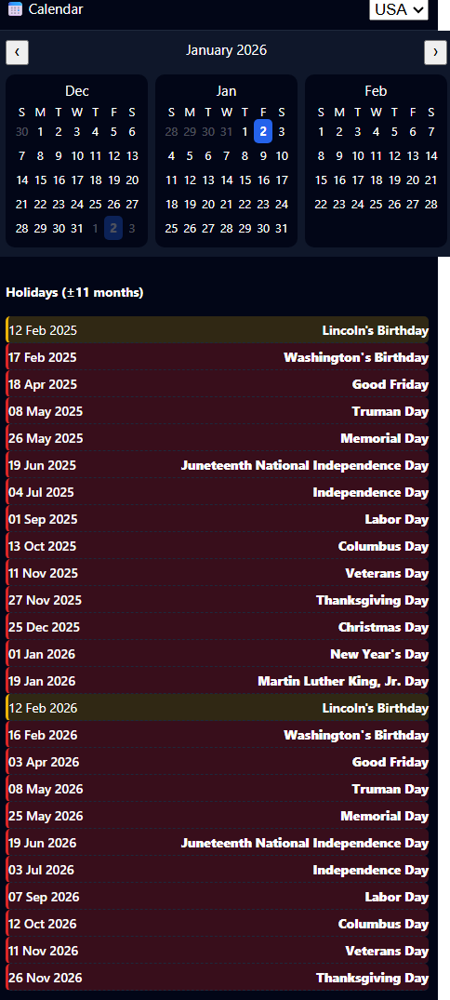

# Untitled — Rolling Holiday Calendar

<!-- Add project screenshot -->



_A sample screenshot of the app UI (three-month calendar + holiday panel)._

A small React app that displays a three-month calendar and a rolling list of holidays for a selected country.

Built with Create React App and dayjs. The app fetches public holiday data from the free Nager.Date API and shows which weeks contain work-affecting holidays.

Key features
- Three-month calendar view with previous/next navigation (`src/components/CalendarThreeMonth.js`).
- Individual month rendering with day cells and week indicators (`src/components/MonthView.jsx`).
- Rolling holidays panel that fetches and normalizes holiday data for ±11 months (`src/components/HolidayView.js`, `src/services/holidayService.js`, `src/services/holidayNormalizer.js`).
- Simple in-memory caching of API results and prioritization of work-related holiday types (`src/services/holidayPriority.js`).

Prerequisites
- Node.js (LTS recommended) and npm (bundled with Node.js).
- Windows users: PowerShell is the default dev shell for this repo.

Quick start

1. Install dependencies

```bash
npm install
```

2. Run the dev server (PowerShell example)

```powershell
# start on a different port (optional)
$env:PORT=3001; npm start
# or default
npm start
```

3. Open http://localhost:3000 in your browser.

Available scripts
- `npm start` — start development server with hot reload
- `npm test` — run tests (Jest + React Testing Library)
- `npm run build` — create production build in `build/`
- `npm run eject` — eject CRA configuration (one-way)

Project structure (important files)
- `public/` — static assets and `index.html`
- `src/index.js` — app entry
- `src/App.js` — root component that wires the calendar and holiday panel
- `src/components/CalendarThreeMonth.js` — three-month navigation and rendering
- `src/components/MonthView.jsx` — month grid and day rendering
- `src/components/HolidayView.js` — fetches and renders rolling holidays
- `src/services/holidayService.js` — fetches holidays from the API and caches results
- `src/services/holidayNormalizer.js` — normalizes API payloads and filters by date range
- `src/services/holidayPriority.js` — determines whether a holiday is work-affecting
- `src/hooks/useApi.js` — small reusable hook for cancellable API calls
- `src/utils/weekIndicators.js` — (utility for week computation)

API details
- Default API: https://date.nager.at/api/v3
- `src/services/holidayService.js` requests public holidays for the previous, current, and next year to build a rolling window.
- Results are normalized and filtered to approximately ±11 months around the current date.

Caching and behavior notes
- A simple in-memory `Map` (`holidayCache`) caches responses per country for the lifetime of the page.
- `holidayNormalizer` will keep one holiday per date and prefer holidays classified as work-affecting when multiple entries exist for the same date.
- If you need to change the API base URL, modify `API_BASE` in `src/services/holidayService.js`.

Testing
- Basic tests are present (see `src/App.test.js`). Run them with `npm test`.
- The project uses Jest and React Testing Library (as provided by CRA).

Building & Deployment
- Build:

```bash
npm run build
```

- Deploy the contents of the `build/` folder to any static hosting (Netlify, Vercel, GitHub Pages, IIS, S3, etc.).
- If you want GitHub Pages, consider the `gh-pages` package or follow CRA deployment docs.

Troubleshooting
- If port 3000 is in use, set `PORT` before starting (PowerShell example above).
- Holiday API failures: the app logs fetch errors to the console and shows a friendly message in the UI. The free Nager.Date service may rate limit or temporarily fail.
- To force-refresh cached holidays during development, refresh the page or restart the dev server (the cache is in-memory only).

Contributing
- Open issues and PRs. Keep changes focused and include tests where appropriate.
- The codebase follows common CRA conventions — place new components under `src/components` and services under `src/services`.

License
- No license is specified. Add a `LICENSE` file or specify a license in `package.json` if you want one.

Notes and next steps (optional improvements)
- Extract `API_BASE` to an environment variable like `REACT_APP_API_BASE` for easier configuration.
- Add visual indicators or tooltips to explain week-level holiday counts in the calendar.
- Add unit tests for `holidayNormalizer` and `holidayService` to lock in expected behavior.

---
Generated by the project maintainer's tooling; please edit the project title, license, or screenshots as desired.
